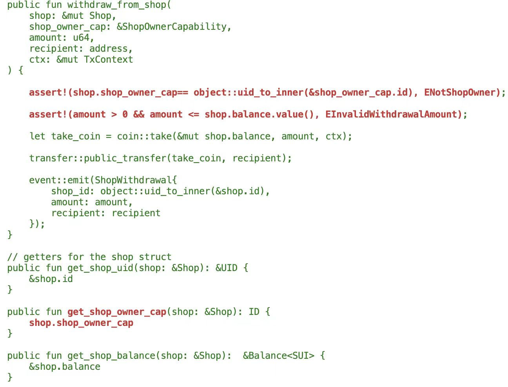
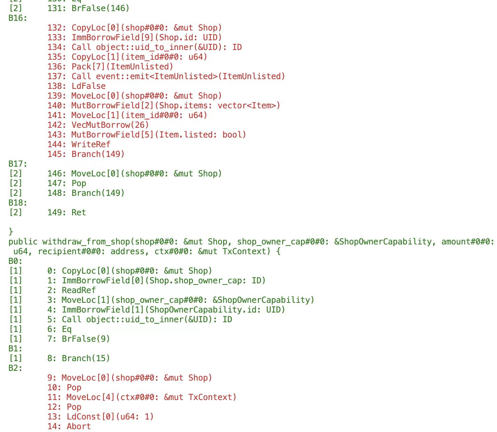

# Move

## 1 命令说明

`sui move`的子命令集是用于构建和测试`Move`合约的，以下将进行分类并逐一介绍命令的使用。

可通过`help/-h`获取完整的子命令：

```bash
$ sui move -h
Tool to build and test Move applications

Usage: sui move [OPTIONS] <COMMAND>

Commands:
  build
  coverage        Inspect test coverage for this package. A previous test run with the
                      `--coverage` flag must have previously been run
  disassemble
  manage-package  Record addresses (Object IDs) for where this package is published on chain (this
                      command sets variables in Move.lock)
  migrate         Migrate to Move 2024 for the package at `path`. If no path is provided defaults
                      to current directory
  new             Create a new Move package with name `name` at `path`. If `path` is not provided
                      the package will be created in the directory `name`
  test            Run Move unit tests in this package
```

## 2 命令分类

根据命令实现功能分为以下几类：

### 2.1 项目类

| 子命令            | 功能说明                         |
| -----------------| -------------------------------- |
| [**`new`**]()     | 创建`Move`项目 |
| [**`build`**]()     | 编译并构建`Move`项目 |

### 2.2 测试类

| 子命令            | 功能说明                         |
| -----------------| -------------------------------- |
| [**`test`**]()     | 运行`Move`项目的单元测试 |
| [**`coverage`**]()     | 检查测试覆盖率 |

### 2.3 迁移类

| 子命令            | 功能说明                         |
| -----------------| -------------------------------- |
| [**`migrate`**]()     | 老版合约语法迁移到`Move 2024`新版语法 |

### 2.4 其它类

| 子命令            | 功能说明                         |
| -----------------| -------------------------------- |
| [**`disassemble`**]()     | 反汇编`Move`字节码 |
| [**`manage-package`**]()     | 记录包的发布地址 |

## 3 命令详解

### 3.1 项目类

#### 3.1.1 `new`: 创建`Move`项目
##### (1) 命令说明
执行该命令可以更具指定名称创建一个新的`Move`项目。
```
Create a new Move package with name `name` at `path`. If `path` is not provided the package will be
created in the directory `name`

Usage: sui move new [OPTIONS] <NAME>

Arguments:
  <NAME>  The name of the package to be created
```

##### (2) 命令使用
> 命令成功执行后，将会搭建起基本的项目工程。
```bash
$ sui move new simple_bank

$ tree simple_bank/
simple_bank/
├── Move.toml
├── sources
│   └── simple_bank.move
└── tests
    └── simple_bank_tests.move
```

#### 3.1.2 `build`: 编译并构建`Move`项目
##### (1) 命令说明
```
Usage: sui move build [OPTIONS]
```

##### (2) 命令使用

- **执行编译命令**
```bash
$ sui move build
UPDATING GIT DEPENDENCY https://github.com/MystenLabs/sui.git
INCLUDING DEPENDENCY Sui
INCLUDING DEPENDENCY MoveStdlib
BUILDING simple_bank
```

- **查看编译后输出的结果**
> 可以看到生成的合约字节码文件：`simple_bank.mv`
```
$ tree -L 3 build/
build/
├── locks
└── simple_bank
    ├── BuildInfo.yaml
    ├── bytecode_modules
    │   ├── dependencies
    │   └── simple_bank.mv
    ├── source_maps
    │   ├── dependencies
    │   └── simple_bank.mvsm
    └── sources
        ├── dependencies
        └── simple_bank.move
```

### 3.2 测试类
#### 3.2.1 `test`: 运行`Move`项目的单元测试
##### (1) 命令说明
执行该命令可以运行当前`Move`项目的单元测试。
```
Run Move unit tests in this package

Usage: sui move test [OPTIONS] [filter]

Arguments:
  [filter]  An optional filter string to determine which unit tests to run. A unit test will be run
            only if it contains this string in its fully qualified
            (<addr>::<module_name>::<fn_name>) name
```

##### (2) 命令使用

- **跑全量单元测试**
```bash
$ sui move test

INCLUDING DEPENDENCY Sui
INCLUDING DEPENDENCY MoveStdlib
BUILDING sui_marketplace
Running Move unit tests
[ PASS    ] movefans::sui_marketplace_tests::test_add_item
[ PASS    ] movefans::sui_marketplace_tests::test_add_item_failure
[ PASS    ] movefans::sui_marketplace_tests::test_create_shop
[ PASS    ] movefans::sui_marketplace_tests::test_purchase_item
[ PASS    ] movefans::sui_marketplace_tests::test_purchase_item_failure
[ PASS    ] movefans::sui_marketplace_tests::test_unlist_item
[ PASS    ] movefans::sui_marketplace_tests::test_withdraw_from_shop
Test result: OK. Total tests: 7; passed: 7; failed: 0
```

- **跑指定单元测试**
> 可以根据单元测试名称，跑指定单元测试

```bash
$ sui move test test_add_item

INCLUDING DEPENDENCY Sui
INCLUDING DEPENDENCY MoveStdlib
BUILDING sui_marketplace
Running Move unit tests
[ PASS    ] movefans::sui_marketplace_tests::test_add_item
[ PASS    ] movefans::sui_marketplace_tests::test_add_item_failure
Test result: OK. Total tests: 2; passed: 2; failed: 0
```

#### 3.2.2 `coverage`: 查看测试覆盖率
##### (1) 命令说明
执行该命令可以分析当前项目的测试覆盖率。在之前，需要先运行`sui test --coverage`命令，生成测试覆盖率报告。

> 注：需要使用`debug`模式`Sui CLI`，方可使用`--coverage`参数，否则会提示：
> ```
> The --coverage flag is currently supported only in debug builds. Please build the Sui CLI from source in debug mode.
> ```

```bash
Inspect test coverage for this package. A previous test run with the `--coverage` flag
must have previously been run

Usage: sui move coverage [OPTIONS] <COMMAND>

Commands:
  summary   Display a coverage summary for all modules in this package
  source    Display coverage information about the module against source code
  bytecode  Display coverage information about the module against disassembled bytecode
```
##### (2) 命令使用

- **执行测试命令，开启覆盖率分析**
```bash
$ /data/sui/target/debug/sui move test --coverage
INCLUDING DEPENDENCY Sui
INCLUDING DEPENDENCY MoveStdlib
BUILDING sui_marketplace
Running Move unit tests
[ PASS    ] movefans::sui_marketplace_tests::test_add_item
[ PASS    ] movefans::sui_marketplace_tests::test_add_item_failure
[ PASS    ] movefans::sui_marketplace_tests::test_create_shop
[ PASS    ] movefans::sui_marketplace_tests::test_purchase_item
[ PASS    ] movefans::sui_marketplace_tests::test_purchase_item_failure
[ PASS    ] movefans::sui_marketplace_tests::test_unlist_item
[ PASS    ] movefans::sui_marketplace_tests::test_withdraw_from_shop
Test result: OK. Total tests: 7; passed: 7; failed: 0
```

- **命令成功执行，将会在当前目录生成以下文件**
```
.trace
.coverage_map.mvcov
```

- **查看测试覆盖率汇总信息**

> 根据输出内容可见该项目的单测覆盖率为：76.40%
```bash
$ sui move coverage summary

+-------------------------+
| Move Coverage Summary   |
+-------------------------+
Module 0000000000000000000000000000000000000000000000000000000000000000::sui_marketplace
>>> % Module coverage: 76.40
+-------------------------+
| % Move Coverage: 76.40  |
+-------------------------+
```

- **查看源代码层面模块单测覆盖率**
```bash
$ sui move coverage source --module sui_marketplace
```

> 将会输出如下信息，显式红色的代码片段表示未被单测覆盖



- **查看字节码层面模块单测覆盖率**
```bash
$ sui move coverage bytecode --module  sui_marketplace
```



### 3.3 迁移类

#### 3.3.1 `migrate`: 老版合约语法迁移到`Move 2024`新版语法

`SUI Move`在`2024`年迎来重大更新，引入了许多新功能，涵盖**新特性**，例如：**方法语法（`method syntax`）**、**位置域（`positional fields`）**、**循环标签（`loop labels`）**等，以及**不兼容更新**，例如：**数据类型可见性（Datatype visibility requirements）**、 **可变性要求（Mutability requirements）** 等。这些更新为`Move`编程语言引入了新的定义数据和调用函数的方式等，使得在`Sui`上构建应用程序更加高效灵活，也为未来要推出的新功能铺平道路。

如何快速将历史传统`Move`合约迁移到`Sui Move 2024`新版合约语法，使用该命令即可。

##### (1) 命令说明
执行该命令可以将历史传统`Move`合约迁移到`Sui Move 2024`新版合约语法。

```bash
Migrate to Move 2024 for the package at `path`. If no path is provided defaults to current directory

Usage: sui move migrate [OPTIONS]
```

##### (2) 命令使用

> 命令成功执行后，终端会显示要进行的更改的合约差异，如果接受更改，会自动将现存 **历史版本（`legacy`）** 的合约，迁移成 **新版合约（`2024.beta`）** 代码，并会更新`Move.toml`文件，同时也会生成一个`migration.patch`文件，将变更差异记录在其中。
> 更多介绍可参考：
> https://blog.sui.io/move-2024-migration-guide/
> https://learnblockchain.cn/article/7824

```bash
$ sui move migrate
UPDATING GIT DEPENDENCY https://github.com/MystenLabs/sui.git
Package toml does not specify an edition. As of 2024, Move requires all packages to define a language edition.

Please select one of the following editions:

1) 2024.beta
2) legacy

Selection (default=1): 1

Would you like the Move compiler to migrate your code to Move 2024? (Y/n) y

Generated changes . . .
INCLUDING DEPENDENCY Sui
INCLUDING DEPENDENCY MoveStdlib
BUILDING simple_bank

The following changes will be made.
============================================================

--- ./sources/simple_bank.move
+++ ./sources/simple_bank.move
@@ -15 +15 @@
-    struct SimpleBank has key {
+    public struct SimpleBank has key {
@@ -20 +20 @@
-    struct EventDeposit has copy, drop {
+    public struct EventDeposit has copy, drop {
@@ -26 +26 @@
-    struct EventWithdraw has copy, drop {
+    public struct EventWithdraw has copy, drop {


============================================================
Apply changes? (Y/n) y

Updating "./sources/simple_bank.move" . . .

Changes complete
Wrote patchfile out to: ./migration.patch

Recorded edition in 'Move.toml'
```

### 3.4 其它类
#### 3.4.1 `disassemble`: 反汇编`Move`字节码
##### (1) 命令说明
执行该命令可以反汇编`Move`二进制字节码文件为汇编代码。
```
Usage: sui move disassemble [OPTIONS] <module_path>

Arguments:
  <module_path>  Path to a .mv file to disassemble

```

##### (2) 命令使用
```bash
$ sui move disassemble ./build/simple_bank/bytecode_modules/simple_bank.mv
// Move bytecode v6
module 0.simple_bank {
use 0000000000000000000000000000000000000000000000000000000000000002::balance;
use 0000000000000000000000000000000000000000000000000000000000000002::coin;
use 0000000000000000000000000000000000000000000000000000000000000002::event;
use 0000000000000000000000000000000000000000000000000000000000000002::object;
use 0000000000000000000000000000000000000000000000000000000000000002::sui;
use 0000000000000000000000000000000000000000000000000000000000000002::transfer;
use 0000000000000000000000000000000000000000000000000000000000000002::tx_context;
use 0000000000000000000000000000000000000000000000000000000000000002::vec_map;


struct SimpleBank has key {
        id: UID,
        balances: VecMap<address, Balance<SUI>>
}
struct EventDeposit has copy, drop {
        sender: address,
        amount: u64,
        balance: u64
}
struct EventWithdraw has copy, drop {
        sender: address,
        amount: u64,
        balance: u64
}

init(ctx#0#0: &mut TxContext) {
B0:
        0: MoveLoc[0](ctx#0#0: &mut TxContext)
        1: Call object::new(&mut TxContext): UID
        2: Call vec_map::empty<address, Balance<SUI>>(): VecMap<address, Balance<SUI>>
        3: Pack[0](SimpleBank)
        4: Call transfer::share_object<SimpleBank>(SimpleBank)
        5: Ret

}
entry public deposit(simpleBank#0#0: &mut SimpleBank, amount#0#0: &mut Coin<SUI>, ctx#0#0: &mut TxContext) {
L0:     value#1#0: u64
B0:
        0: CopyLoc[1](amount#0#0: &mut Coin<SUI>)
        1: FreezeRef
        2: Call coin::value<SUI>(&Coin<SUI>): u64
        3: LdU64(0)
        4: Gt
        5: BrFalse(7)
B1:
        6: Branch(15)
B2:
        7: MoveLoc[0](simpleBank#0#0: &mut SimpleBank)
        8: Pop
        ......
        51: MoveLoc[6](value#1#0: u64)
        52: MoveLoc[5](totalBalance#1#0: u64)
        53: Pack[1](EventDeposit)
        54: Call event::emit<EventDeposit>(EventDeposit)
        55: Ret

}
entry public withdraw(simpleBank#0#0: &mut SimpleBank, amount#0#0: u64, ctx#0#0: &mut TxContext) {
B0:
        0: CopyLoc[1](amount#0#0: u64)
        1: LdU64(0)
        2: Gt
        3: BrFalse(5)
B1:
        4: Branch(11)
B2:
        5: MoveLoc[0](simpleBank#0#0: &mut SimpleBank)
        6: Pop
        7: MoveLoc[2](ctx#0#0: &mut TxContext)
        8: Pop
        ......
        57: FreezeRef
        58: Call balance::value<SUI>(&Balance<SUI>): u64
        59: Pack[2](EventWithdraw)
        60: Call event::emit<EventWithdraw>(EventWithdraw)
        61: Ret

}

Constants [
        0 => u64: 1
        1 => u64: 2
        2 => u64: 3
]
}
```

#### 3.4.2 `manage-package`: 记录包的发布地址
##### (1) 命令说明
执行该命令可以手工区记录包的发布地址。

参数说明：
- `--environment`: 指定当前链网络环境，可通过命令`sui client active-env`查看
- `--network-id`: 指定当前链网络ID，可通过命令`sui client chain-identifier`查看
- `--original-id`: 指定包首次发布的地址，若未升级过包，则该地址与`Move.toml`中的`published-at`地址相同
- `--latest-id`: 指定当前包的最新地址，若未升级过包，则与`--original-id`相同；若升级了包，这与当前在`Move.toml`中的`published-at`地址相同
- `--version-number`: 指定当前包的版本号

```
Record addresses (Object IDs) for where this package is published on chain (this command sets
variables in Move.lock)

Usage: sui move manage-package [OPTIONS] --environment <ENVIRONMENT> --network-id <CHAIN_ID> --original-id <ORIGINAL_ID> --latest-id <LATEST_ID> --version-number <VERSION_NUMBER>
```
##### (2) 命令使用
```bash
sui move manage-package --environment "$(sui client active-env)" \
                  --network-id "$(sui client chain-identifier)" \
                  --original-id 'ORIGINAL-ADDRESS' \
                  --latest-id 'LATEST-ADDRESS' \
                  --version-number 'VERSION-NUMBER'
```
